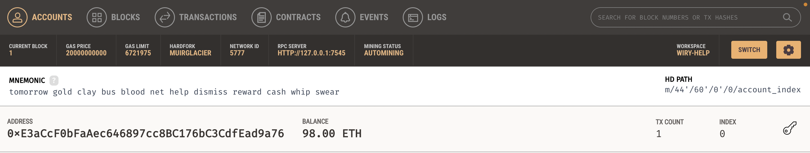
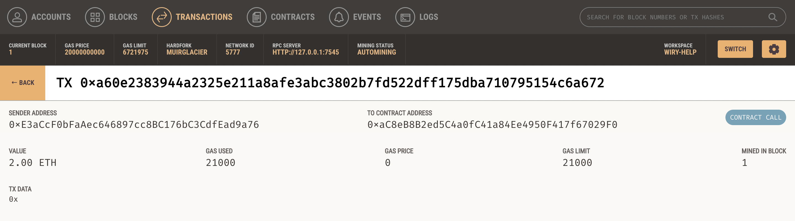

# Homework-BlockchainWallet

#### Background

Build a new and disruptive platform called Fintech Finder. Fintech Finder is an application that its customers can use to find fintech professionals from among a list of candidates, hire them, and pay them. As Fintech Finder’s lead developer, the task is to integrate the Ethereum blockchain network into the application in order to enable customers to instantly pay the fintech professionals whom they hire with cryptocurrency.

#### Structure:

Used two Python files structure for creating the platform.

The first file is called fintech_finder.py. It contains the code associated with the web interface of application. The code included in this file is compatible with the Streamlit library. 

The second file is called crypto_wallet.py. This file contains the Ethereum transaction functions. Used import statements to integrate the crypto_wallet.py Python script into the Fintech Finder interface program that is found in the fintech_finder.py file.

Integrating these two files allow to automate the tasks associated with generating a digital wallet, accessing Ethereum account balances, and signing and sending transactions via a personal Ethereum blockchain called Ganache.

#### Screenshot of Fintech Finder 

#### Screenshot of your address balance and history on Ganache

#### Screenshot of the transaction details on Ganache

